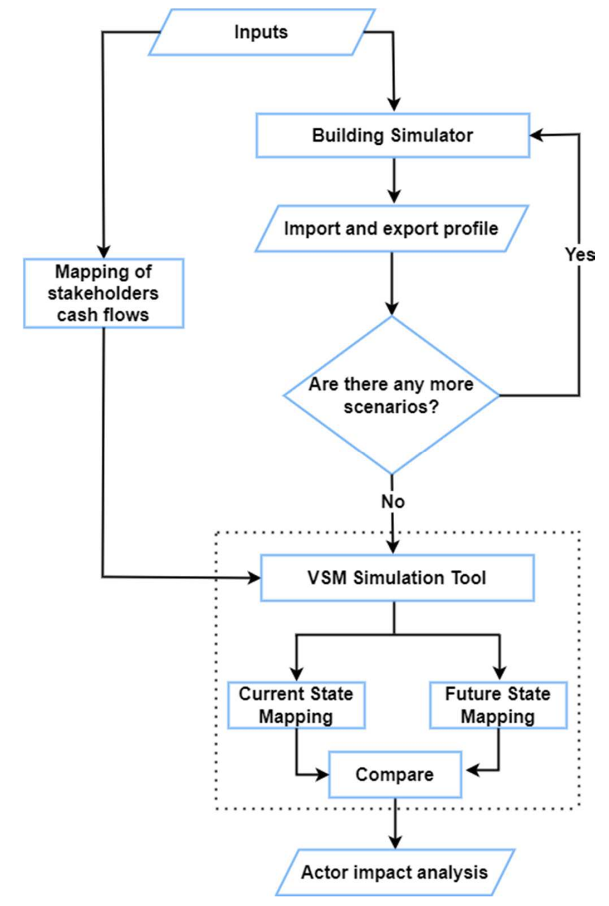

# VSM-Analysis-Tool

This repository contains code to perform a value stream mapping (VSM) analysis of the impacts of rising prosumers on stakeholders in the energy industry. However, this VSM tool can be applied to assess the impacts of other changes or scenarios in energy systems as well.

It implements the methodology proposed in the paper "Value Stream Mapping of Stakeholder Impacts from Rising Prosumers":

[IEEE](https://ieeexplore.ieee.org/document/9960439)

[ResearchGate](https://www.researchgate.net/publication/365835174_Value_Stream_Mapping_of_Stakeholder_Impacts_from_Rising_Prosumers)

## Description

The emergence of distributed energy resources like solar PV and batteries enables consumers to become prosumers - both producing and consuming electricity. However, the impacts of rising prosumerism on industry stakeholders have not been well studied.

The methodology is as follows:

The output is an analysis of how the change affects different stakeholders.

## Usage

The main file is Value Stream Mapping Analysis Tool.ipynb. It contains key functions to run a VSM analysis.

To use:

1. Download the 'VSM_Input_File.xlsx' and populate it.
2. Run run_full_analysis to execute the VSM analysis
3. Results and visualizations will be displayed

Functions can also be called individually as needed.

Feel free to contact me on LinkedIn if you have any other questions!

Follow the binder link to run the tool in your browser:

